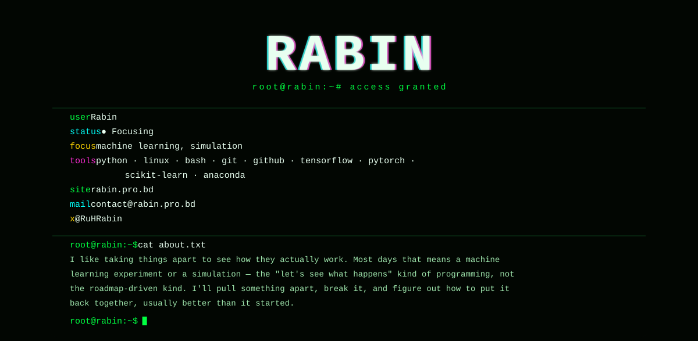

  

[rabin.pro.bd](https://rabin.pro.bd) · [contact@rabin.pro.bd](mailto:contact@rabin.pro.bd) · [@RuHRabin](https://x.com/RuHRabin)

---

### `$ ls ~/pinned`

<!--START_SECTION:pinned-->

<!--END_SECTION:pinned-->

### `$ ls ~/recent --sort=time`

<!--START_SECTION:recent-->

<!--END_SECTION:recent-->

### `$ cat stats.log`

---

`root@rabin:~$ xdg-open` [github.com/RuHRabin](https://github.com/RuHRabin?tab=repositories)

