[](https://github.com/RuHRabin/RuHRabin/actions/workflows/update-pinned.yml)

[rabin.pro.bd](https://rabin.pro.bd) · [contact@rabin.pro.bd](mailto:contact@rabin.pro.bd) · [@RuHRabin](https://x.com/RuHRabin)

---

### Pinned

```bash
rabin@kernel:~$ gh repo list RuHRabin --pinned
```

<!--START_SECTION:pinned-->

<!--END_SECTION:pinned-->

### Recently active

```bash
rabin@kernel:~$ gh repo list RuHRabin --limit 5 --json name,pushedAt --jq 'sort_by(.pushedAt) | reverse'
```

<!--START_SECTION:recent-->

<!--END_SECTION:recent-->

### By the numbers

```bash
rabin@kernel:~$ gh api users/RuHRabin/stats
```

<div align="center">


</div>

---

```bash
rabin@kernel:~$ xdg-open https://github.com/RuHRabin?tab=repositories
```

More on [GitHub](https://github.com/RuHRabin?tab=repositories).
